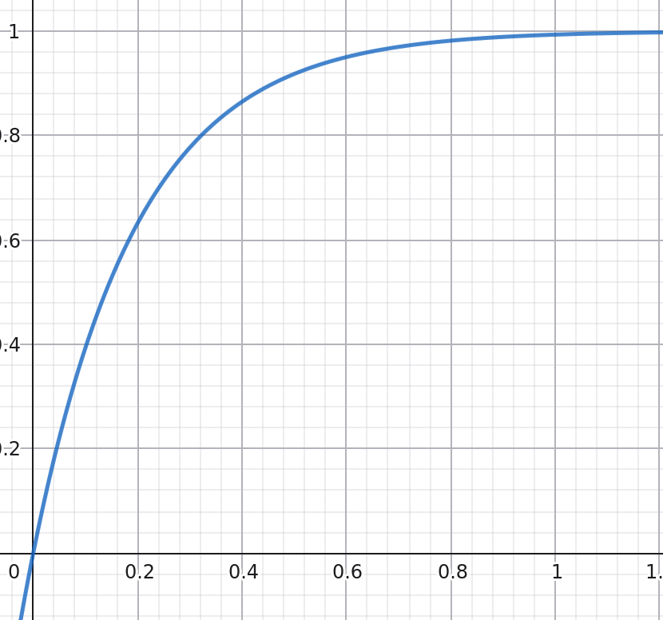

# Algoritem sprotnega pokrivanja košev
Mark Loboda, Luka Pantar

Naš algoritem je sestavljen iz treh glavnih korakov, branje vhoda, procesiranje ter sortiranje elementov v koše in pisanje rezultata v izhodno datoteko.

## 1. Branje vhoda
Ta korak je najenostavnejši in najprej odpre podano besedilno datoteko. Iz nje prebere število elementov v prvi vrstici, nato pa prebere vse elemente po vrsti ter jih zapiše v seznam.

## 2. Procesiranje
Ta korak skrbi za procesiranje vhoda in iskanje rešitve. Algoritem po vrsti bere vhodne elemente ter jih takoj dokončno vmesti v izbran koš. Koše hranimo v tako imenovanem urejenem binarnem drevesu, ki je urejen po trenutni vsoti elementov v njem. Prav tako določimo mejo, čez katero koš ne sme jiti, ko vanj vmestimo trenutni element. Meja je definirana z razmerjem med odprtimi koši (koši, ki še niso polni) ter preostalimi elementi, ki jih še moramo razvrstiti (označen z R). Nato razmerje uporabimo za izračun meje z enačbo:
$$1.0 - e^{-5 * R}$$

{ width=50% }

Slika 1: Prikaz funkcije naraščanja meje.

Po izračunani meji poiščemo najbolši koš, v katerega bi lahko vmestili element in je še zmeraj pod mejo. To naredimo s sprehodom po drevesu in računanjem odstopanja od vrednosti 1.0. Tako najdemo najboljši koš za umestitev elementa.

V primeru, da smo koš našli, ga najprej odstanimo iz drevesa, vanj vmestimo element, nato pa ga ponvno vstavimo v drevno na pravo mesto, da obdržimo urejenost.

V primeru, da koša nismo našli zaradi nizke izračunane meje, odpremo nov koš, vanj vstavimo element ter koš vstavimo v drevo.

## 3. Pisanje rezultata
Ta korak je končen in služi procesiranju izhodnih podatkov in s tem pripravljati na podatkov na izpis in samo pisanje podatkov.

Najprej izhodne podatke iz prejšnjega koraka procesiramo. Najprej se sprehodimo skozi seznam košev in preštejemo število zapolnjenih (vsota elementov >= 1). Nato izračunamo odmike košev, ki predstavljajo odmike elementov v vsakem košu, če so elementi zapisani po vrsti z enačbo:
$$offset_{cur} = offset_{prev} + elementCount_{prev}$$

Nato pa v nov seznam vstavimo elemente, razvrščene po indeksu pripadajočega koša.

Na koncu to strukturo izpišemo tako, da v prvo vrstico zapišemo število zapolnjenih košev, nato pa v vsako zaporedno vrstico indekse elementov v pripadajočem košu.